# Canvas Chat

**A self-hosted AI chat where the model writes into a canvas beside the conversation.** It drafts rich documents, code and editable Excalidraw diagrams, and you keep editing them yourself or with AI help.

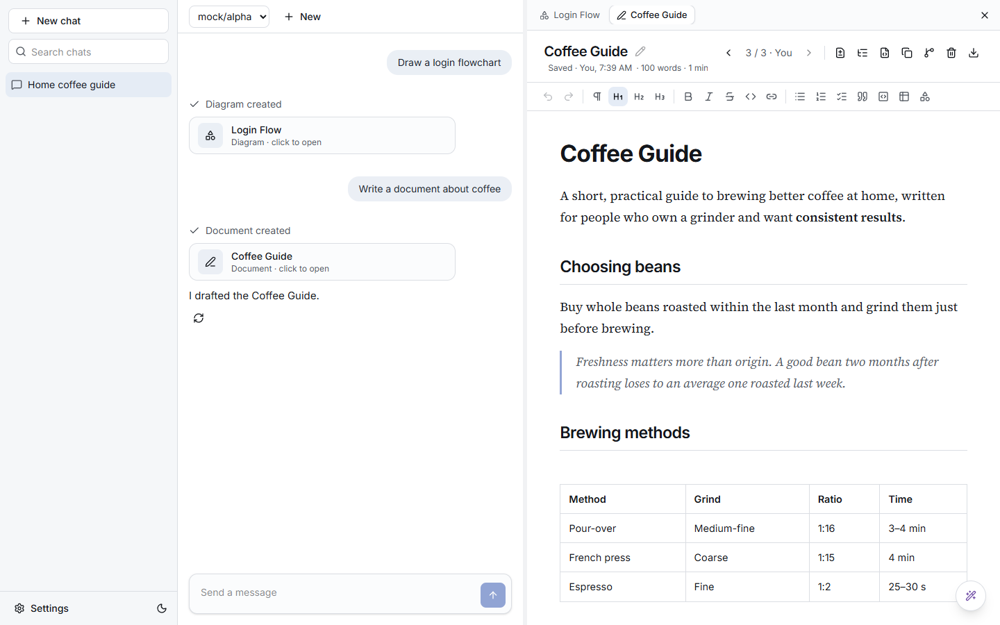

<p align="center">
  <a href="#feature-map">Feature map</a> ·
  <a href="#tour">Tour</a> ·
  <a href="#quick-start">Quick start</a> ·
  <a href="#architecture">Architecture</a> ·
  <a href="#testing">Testing</a> ·
  <a href="#project-docs">Docs</a>
</p>

- **Three canvases in one chat:** documents (Tiptap), code (CodeMirror) and diagrams (Excalidraw), opened as tabs next to the conversation.
- **The AI makes targeted edits, and you can review them:** it changes only the part you asked about, every change becomes a version, and you can diff, restore or branch any version.
- **Diagrams stay editable, in the format you like:** Mermaid, a plain JSON graph, Graphviz DOT, PlantUML or D2 all become real Excalidraw shapes, not flat images. Nested containers become frames.
- **Runs on your machine:** one `docker compose up`, with Postgres for storage. It works with any [OpenRouter](https://openrouter.ai) model, or with a built-in mock model that needs no API key.

---

## Feature map

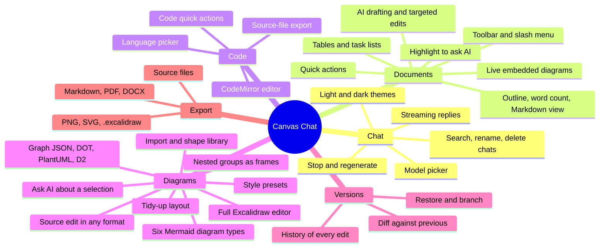
```mermaid
mindmap
  root((Canvas Chat))
    Chat
      Streaming replies
      Model picker
      Stop and regenerate
      Search, rename, delete chats
      Light and dark themes
    Documents
      AI drafting and targeted edits
      Highlight to ask AI
      Quick actions
      Toolbar and slash menu
      Tables and task lists
      Live embedded diagrams
      Outline, word count, Markdown view
    Code
      CodeMirror editor
      Language picker
      Code quick actions
      Source-file export
    Diagrams
      Full Excalidraw editor
      Six Mermaid diagram types
      Graph JSON, DOT, PlantUML, D2
      Nested groups as frames
      Ask AI about a selection
      Style presets
      Tidy-up layout
      Source edit in any format
      Import and shape library
    Versions
      History of every edit
      Diff against previous
      Restore and branch
    Export
      Markdown, PDF, DOCX
      PNG, SVG, .excalidraw
      Source files
```

| Area | What you get | Status |
| --- | --- | --- |
| **Chat** | Streaming replies, per-chat model picker, stop and regenerate, auto-titles, sidebar search, rename and delete, settings page, light and dark themes | ✅ |
| **Documents** | AI creates and edits documents with targeted find/replace edits instead of full rewrites | ✅ |
| | Highlight any text and **Ask AI** to change just that part | ✅ |
| | Quick actions: shorter or longer, simpler or advanced reading level, formal or casual, fix grammar, add emoji, translate | ✅ |
| | Formatting toolbar, `/` slash menu, headings, lists, quotes, code blocks, links | ✅ |
| | Task lists, tables (add and remove rows and columns) | ✅ |
| | **Live diagram embeds** that re-render when the diagram changes | ✅ |
| | Outline panel, word count and reading time, raw-Markdown editing | ✅ |
| **Code** | CodeMirror canvas with syntax highlighting and a picker for 20+ languages | ✅ |
| | AI edits, plus quick actions: add comments, add logging, fix bugs, optimise, port to another language | ✅ |
| **Diagrams** | Full Excalidraw editor: draw, move, restyle, undo | ✅ |
| | AI draws flowchart, sequence, class, state, ER and mind-map diagrams as editable shapes | ✅ |
| | Select shapes and **Ask AI** to recolour, relabel or extend them | ✅ |
| | Style presets (Colourful, Monochrome, Clean, Sketchy) and one-click tidy-up layout | ✅ |
| | **Beyond Mermaid:** a JSON graph (nodes, edges, nested groups), Graphviz DOT, PlantUML and D2, with automatic layout and group frames | ✅ |
| | View and edit the source in any of these formats, then redraw it; syntax errors point to the line | ✅ |
| | `.excalidraw` import and a persisted shape library | ✅ |
| **Versions** | Every AI or user change is a version: step through them, diff against the previous version, restore, or branch into a new artifact | ✅ |
| **Export** | Documents: Markdown, PDF, DOCX (with diagrams rendered in). Code: source file. Diagrams: PNG (optionally transparent), SVG (optionally dark), `.excalidraw` | ✅ |
| **Planned** | User-defined custom quick actions | 🔜 |

---

## Tour

### Documents

<table>
  <tr>
    <td width="50%">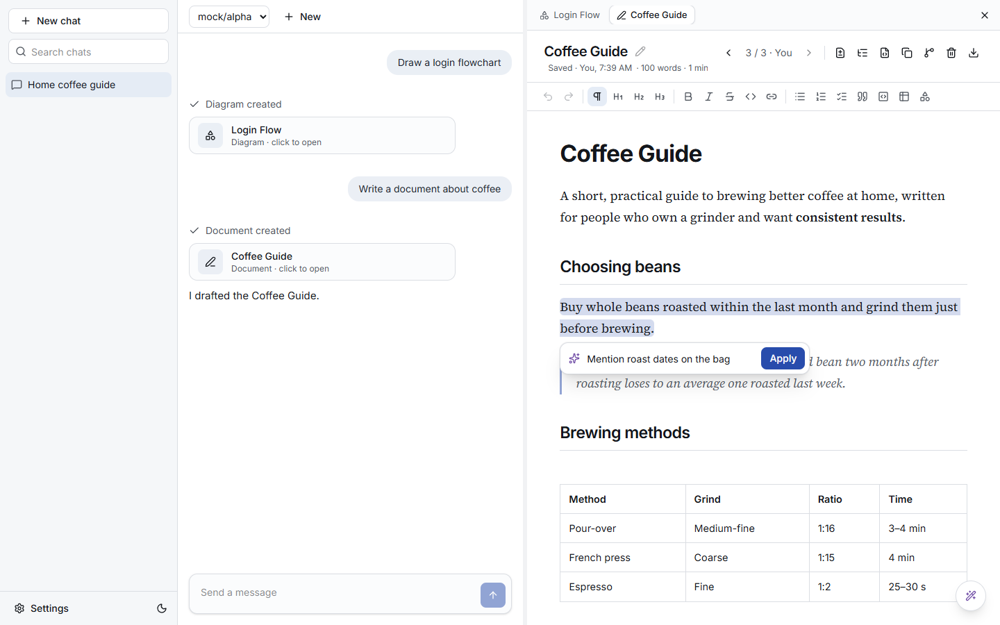</td>
    <td width="50%">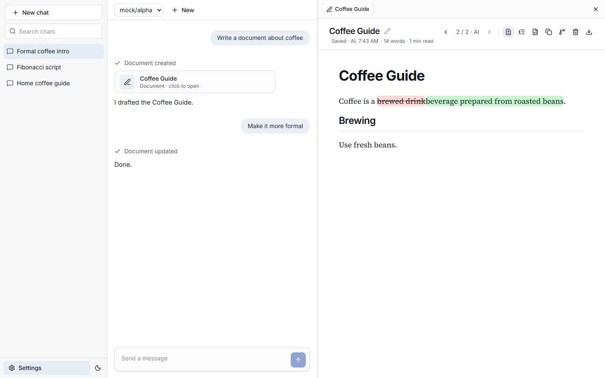</td>
  </tr>
  <tr>
    <td><b>Highlight to edit.</b> Select any passage and tell the AI what to change. Only that passage is rewritten.</td>
    <td><b>See what changed.</b> Each AI edit is a new version. The diff shows removals in red and additions in green.</td>
  </tr>
  <tr>
    <td>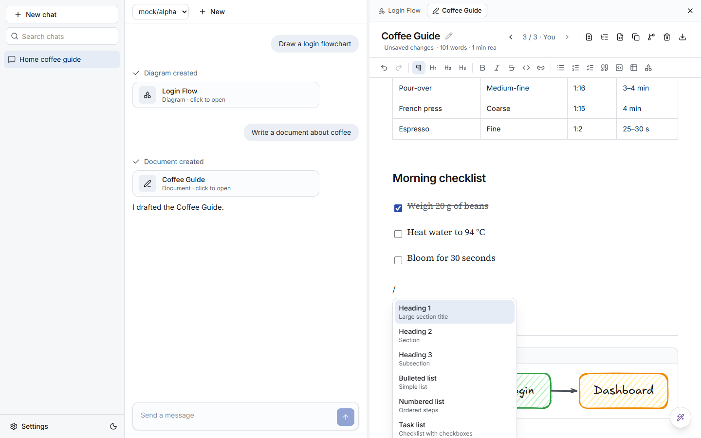</td>
    <td>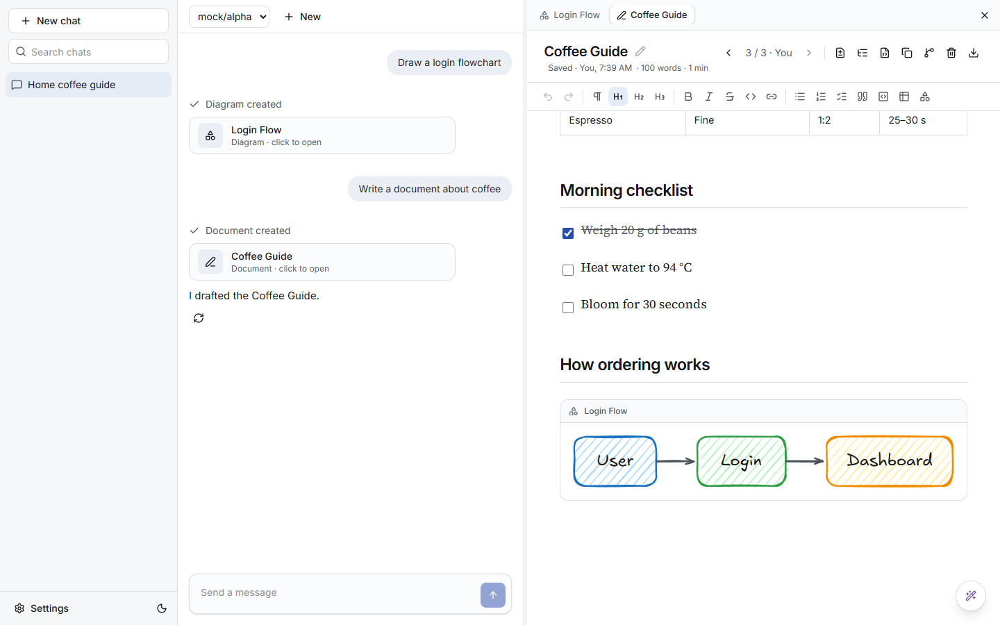</td>
  </tr>
  <tr>
    <td><b>Slash menu and toolbar.</b> Type <code>/</code> for headings, lists, task lists, quotes, code blocks and tables.</td>
    <td><b>Live diagram embeds.</b> Drop a diagram from the same chat into a document. The embed updates when the diagram does.</td>
  </tr>
</table>

### Diagrams

<table>
  <tr>
    <td width="50%">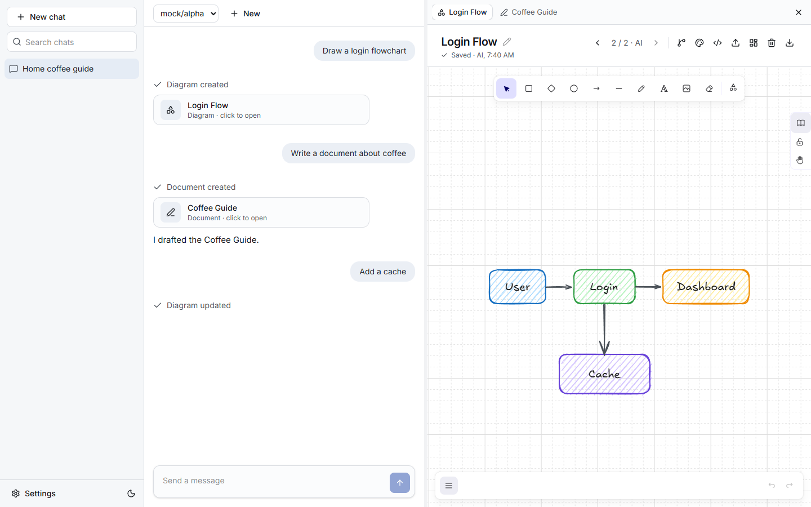</td>
    <td width="50%">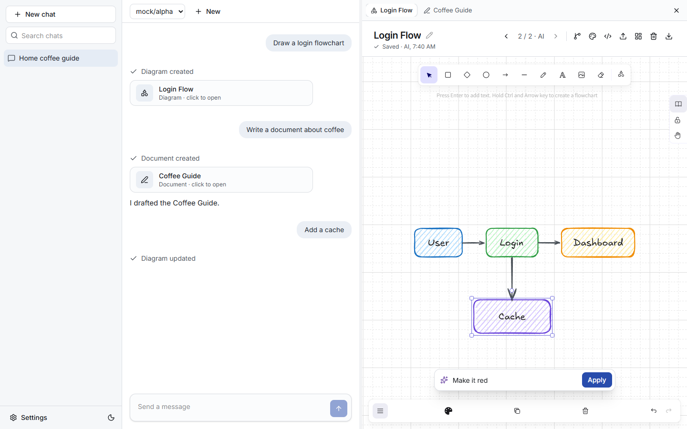</td>
  </tr>
  <tr>
    <td><b>AI-drawn and fully editable.</b> "Draw a login flowchart", then "Add a cache": the AI updates the existing drawing rather than replacing it.</td>
    <td><b>Ask AI about a selection.</b> Select shapes and describe the change you want.</td>
  </tr>
  <tr>
    <td>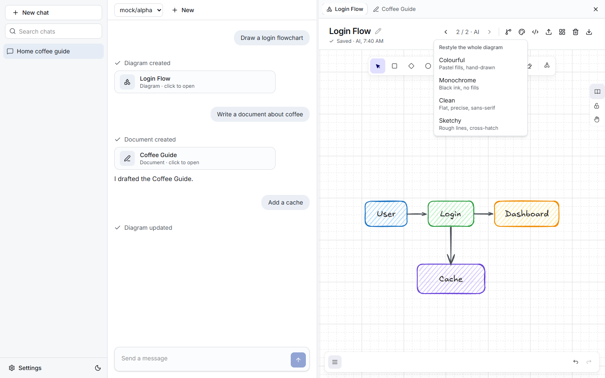</td>
    <td>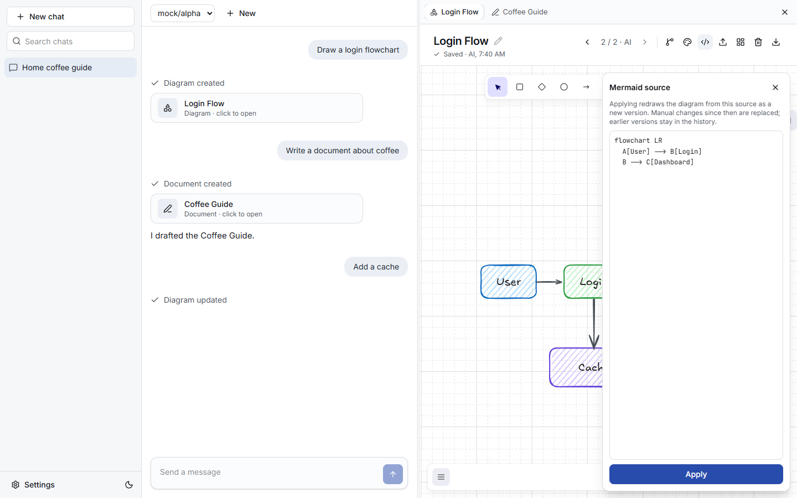</td>
  </tr>
  <tr>
    <td><b>Style presets and tidy-up.</b> Restyle the whole diagram in one click, or re-lay it out neatly.</td>
    <td><b>Source in, shapes out.</b> Read or edit the source (Mermaid, graph, DOT, PlantUML or D2) and redraw it as a new version.</td>
  </tr>
</table>

**Six diagram types, all drawn as editable shapes:**

| Sequence | Class | State |
| --- | --- | --- |
| 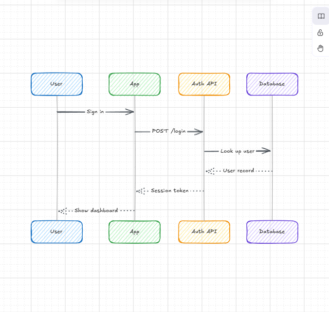 | 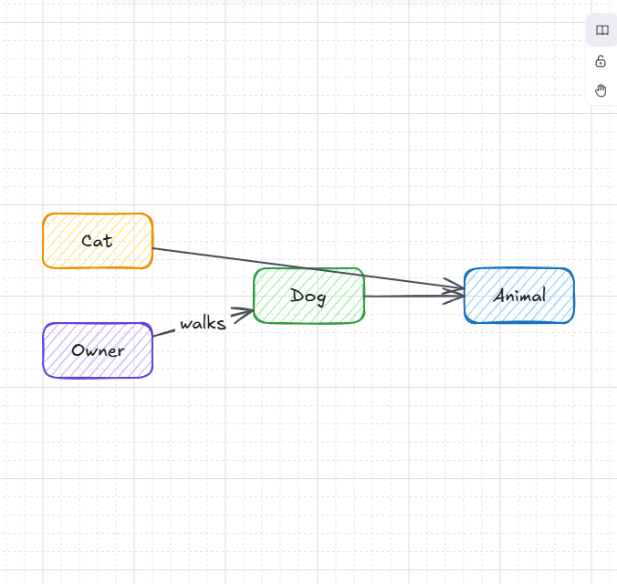 | 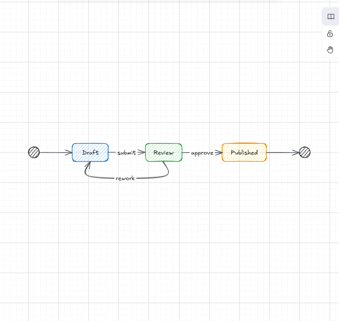 |
| **ER** | **Mind map** | **Flowchart** |
| 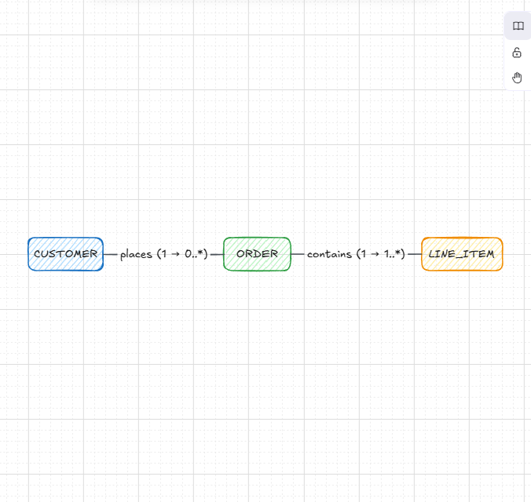 | 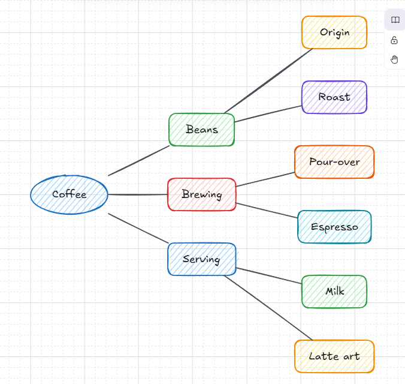 | See above ↑ |

### Beyond Mermaid

The AI (or you, in the source panel) can also write a **JSON graph**, **Graphviz DOT**, **PlantUML** or **D2**. Each group is laid out on its own and then placed as one box in its parent, so frames never overlap and arrows leave a group through a clear lane.

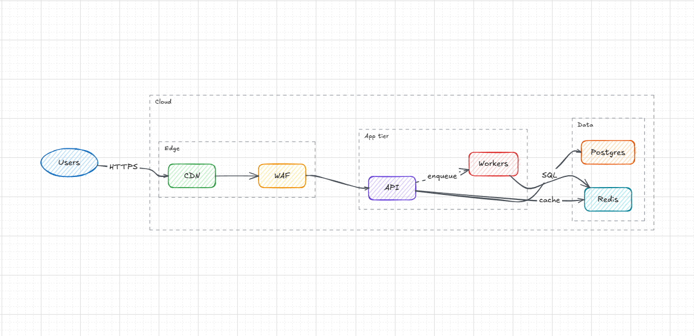

<table>
  <tr>
    <td width="50%">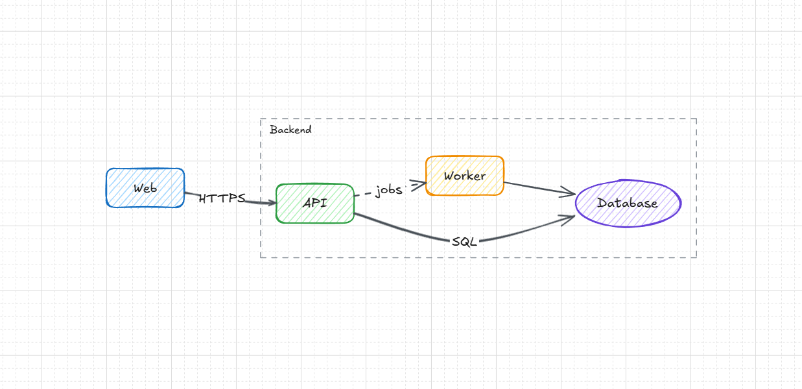</td>
    <td width="50%">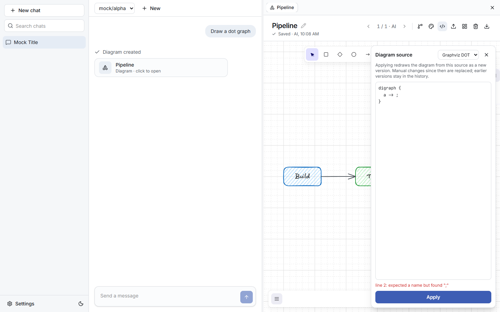</td>
  </tr>
  <tr>
    <td><b>JSON graph.</b> Nodes, edges and groups; the app does the layout. The AI uses this for architecture diagrams.</td>
    <td><b>Pick a language, see errors by line.</b> Bad source never replaces your drawing.</td>
  </tr>
</table>

```d2
direction: right
users: Users { shape: person }
cloud: Cloud {
  app: App tier { api: API; jobs: Workers }
  data: Data { pg: Postgres; redis: Redis }
}
users -> cloud.app.api: HTTPS
cloud.app.api -> cloud.data.pg: SQL
```

Supported syntax for each language is listed in [`docs/DECISIONS.md`](docs/DECISIONS.md) (#23).

### Code and dark mode

<table>
  <tr>
    <td width="50%">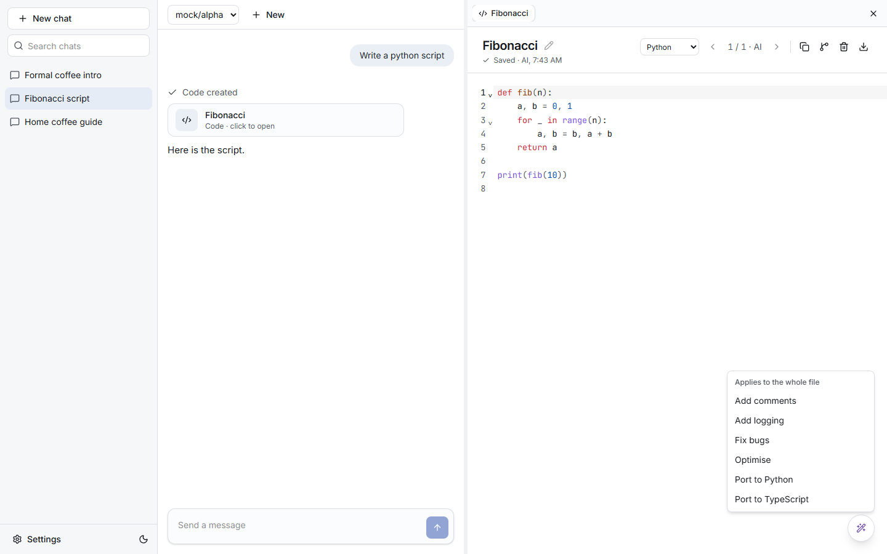</td>
    <td width="50%">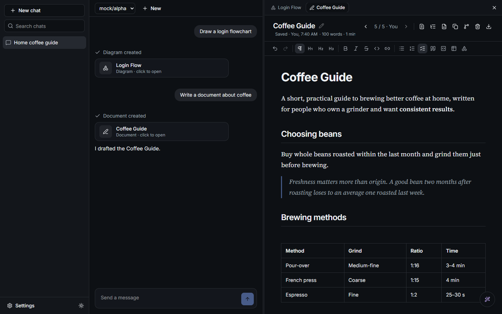</td>
  </tr>
  <tr>
    <td><b>Code canvas.</b> CodeMirror with a language picker, AI edits and one-click code actions.</td>
    <td><b>Dark mode</b> across the chat, documents, code and diagrams.</td>
  </tr>
</table>

---

## Quick start

**Requirements:** Docker. For real models you also need an OpenRouter API key.

```sh
cp .env.example .env
docker compose up -d --build
# open http://127.0.0.1:3000
```

`.env.example` starts with `MOCK_LLM=1`, which uses a scripted mock model, so you can try the app without a key. Try prompts such as *"Write a document about coffee"*, *"Draw a login flowchart"* or *"Write a python script"*.

To use real models, edit `.env`:

```sh
MOCK_LLM=0
OPENROUTER_API_KEY=sk-or-...
ALLOWED_MODELS=<model-a>,<model-b>   # any OpenRouter model ids, shown in the model picker
DEFAULT_MODEL=<model-a>
TASK_MODEL=<model-b>                 # cheaper model for titles and quick actions
```

> [!IMPORTANT]
> The app binds to `127.0.0.1` and has **no login**. It is meant for one person on their own machine. Your API key stays on the server and never reaches the browser.

### Develop locally

```sh
pnpm install
pnpm exec playwright install chromium   # used for PDF export and E2E tests
docker compose up -d postgres           # Postgres on 127.0.0.1:5433
pnpm dev                                # http://127.0.0.1:3000, runs migrations on start
```

---

## Architecture

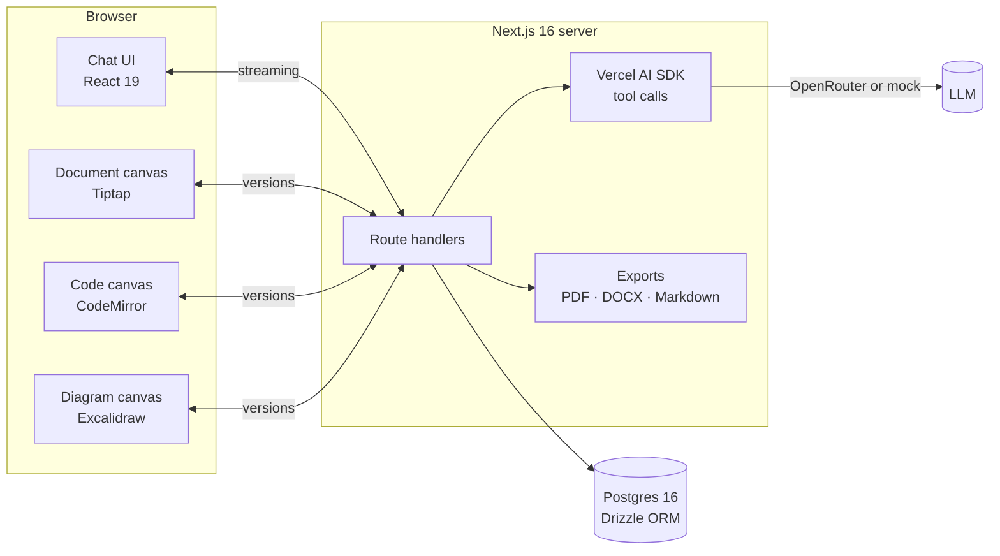
```mermaid
flowchart LR
  subgraph Browser
    UI[Chat UI<br/>React 19]
    DOC[Document canvas<br/>Tiptap]
    CODE[Code canvas<br/>CodeMirror]
    DIA[Diagram canvas<br/>Excalidraw]
  end
  subgraph Server["Next.js 16 server"]
    API[Route handlers]
    AI[Vercel AI SDK<br/>tool calls]
    EXP[Exports<br/>PDF · DOCX · Markdown]
  end
  UI <-->|streaming| API
  DOC & CODE & DIA <-->|versions| API
  API --> AI
  AI -->|OpenRouter or mock| LLM[(LLM)]
  API --> DB[(Postgres 16<br/>Drizzle ORM)]
  API --> EXP
```

- **The model works through tools:** `create_document`, `edit_document`, `rewrite_selection`, `create_code`, `create_diagram` and `update_diagram`. Document edits are find/replace operations rather than full rewrites, so unchanged text stays untouched.
- **Everything is versioned.** Every change by the AI or the user is stored as an immutable artifact version in Postgres. Diffs, restore and branching are built on that history.
- **Diagrams are converted in the browser.** Mermaid becomes Excalidraw shapes through `mermaid-to-excalidraw`. Everything else (Mermaid class, state, ER and mind-map diagrams, JSON graphs, DOT, PlantUML and D2) is parsed into one neutral graph by our own parsers, then laid out as a compound graph and styled. PlantUML sequence diagrams are translated to Mermaid. DOT, PlantUML and D2 are also parsed on the server, so the model gets line-numbered syntax errors back.
- **Exports render on the server.** PDF uses headless Chromium, DOCX uses the `docx` library, and diagram embeds are rendered into both.

| Layer | Tech |
| --- | --- |
| Framework | Next.js 16 (App Router), React 19, TypeScript (strict) |
| UI | Tailwind CSS v4, Radix primitives, Inter / Source Serif 4 / JetBrains Mono |
| Editors | Tiptap v3, CodeMirror 6, Excalidraw 0.18 |
| AI | Vercel AI SDK, OpenRouter provider, scripted mock model |
| Data | Postgres 16, Drizzle ORM |
| Tests | Vitest (146 unit tests), Playwright (52 E2E specs) |

---

## Testing

```sh
pnpm typecheck && pnpm test                         # unit tests
pnpm test:e2e                                       # E2E against pnpm dev with MOCK_LLM=1
BASE_URL=http://127.0.0.1:3000 pnpm test:e2e        # E2E against the Compose stack (MOCK_LLM=1 in .env)
RUN_SMOKE=1 pnpm test:e2e --grep @smoke             # real model; needs OPENROUTER_API_KEY and MOCK_LLM=0
```

The E2E suite runs against the deterministic mock model, so it is fast and needs no network. Each spec maps to an acceptance criterion in [`docs/E2E_TESTS.md`](docs/E2E_TESTS.md).

---

## Project docs

| Doc | What's in it |
| --- | --- |
| [`docs/PRD.md`](docs/PRD.md) | Product requirements and the staged build plan |
| [`docs/E2E_TESTS.md`](docs/E2E_TESTS.md) | The end-to-end test contract |
| [`docs/DECISIONS.md`](docs/DECISIONS.md) | Architecture decisions and why they were made |
| [`docs/VERIFICATION.md`](docs/VERIFICATION.md) | Test results recorded for each stage |
| [`NOTICE.md`](NOTICE.md) | Third-party projects and licences |

## Credits

Built on [Excalidraw](https://github.com/excalidraw/excalidraw), [Tiptap](https://github.com/ueberdosis/tiptap) and [CodeMirror](https://codemirror.net). The document-canvas interaction patterns are inspired by [Open Canvas](https://github.com/langchain-ai/open-canvas). See [`NOTICE.md`](NOTICE.md) for details.

## License

[MIT](LICENSE) © 2026 Donald Miller
