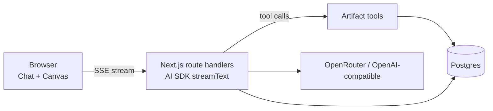

# PRD: Canvas Chat — LLM chat with documents and diagrams

Sep 24, 2026

## Overview

Canvas Chat (working title) is a self-hosted web app where you chat with an LLM and it produces editable documents and diagrams beside the conversation. It is a fresh build from an empty repo, recreating the core behaviour of three open-source products rather than extending any of them.

| Reference product | What we recreate | What we skip |
| --- | --- | --- |
| Open WebUI | Chat UI: conversations, history, streaming, model picker, markdown and code rendering | Plugins, RAG pipelines, multi-backend admin, branding |
| Open Canvas (LangChain) | Side-by-side canvas: the LLM writes a document, you edit it, you highlight text and ask for changes, versions | LangGraph Studio setup, reflection agent, code-only artifacts (later) |
| Excalidraw | Hand-drawn style whiteboard: draw, edit, export | Real-time collaboration rooms, libraries marketplace |

**The problem.** Chat UIs produce walls of text you then copy elsewhere to edit, and diagram tools know nothing about the conversation. The value is one place where the LLM drafts a document or diagram, you refine it by hand or by asking, and both of you always work from the same current version.

## Goals and non-goals

Version 1 succeeds when one user can go from a prompt to a polished, exported document or diagram without leaving the app.

**Goals**

1. A chat experience on par with Open WebUI for daily use: streaming, history, markdown, code blocks, model choice.
2. A document canvas on par with Open Canvas: AI drafts, manual edits, highlight-to-edit, version history.
3. A diagram canvas on par with Excalidraw's single-user editor: AI-generated diagrams you can then edit freely.
4. The LLM always sees the current state of the artifact, including your manual edits.
5. Export to the formats people actually send: Markdown, PDF and DOCX for documents; PNG and SVG for diagrams.
6. Runs with one `docker compose up` on a laptop.

**Non-goals for v1**

- Real-time multi-user collaboration (no Yjs, no shared cursors).
- Public hosting, billing, or multi-tenant scale.
- RAG over uploaded file libraries, web search, or plugin marketplaces.
- Mobile-native apps; the web app must be usable on mobile but is not optimised for it.
- Long-term memory across chats (a candidate for v2).

## Users and user stories

The primary user is you: a technical person running the app locally, writing plans, specs and architecture diagrams. v1 is single-user with no login; multi-user accounts are out of scope.

| # | As a user, I want to… | So that… |
| --- | --- | --- |
| U1 | chat with a model and see the reply stream in | it feels as fast as Open WebUI |
| U2 | return to a past conversation from a sidebar | I can pick work back up |
| U3 | ask for a document and have it open in a canvas beside the chat | I get an editable draft, not a wall of text |
| U4 | edit the document by hand and then ask the AI to continue | it builds on my changes, not its old draft |
| U5 | highlight a passage and ask to rewrite, shorten or expand it | I change one part without regenerating everything |
| U6 | use quick actions (change length, reading level, tone, add emoji, translate) | common edits are one click |
| U7 | ask for a diagram and get an editable Excalidraw drawing | I can fix the layout myself |
| U8 | ask the AI to change an existing diagram (add a node, restyle) | it modifies my drawing instead of redrawing it |
| U9 | step back through versions of any artifact | I can undo an AI change I didn't like |
| U10 | export a document as PDF or DOCX and a diagram as PNG or SVG | I can send it to someone |
| U11 | open several artifacts from one conversation | a plan and its diagram live together |

## Functional requirements

Priority: P0 = v1 must have, P1 = v1 should have, P2 = later.

### Chat

| ID | Requirement | Priority |
| --- | --- | --- |
| C1 | Streaming replies token by token, with a stop button | P0 |
| C2 | Markdown rendering with syntax-highlighted code blocks and copy buttons | P0 |
| C3 | Conversation sidebar: new, rename, delete, search by title | P0 |
| C4 | Model picker per conversation (any OpenAI-compatible or OpenRouter model) | P0 |
| C5 | Auto-generated conversation titles | P1 |
| C6 | Edit and resend a user message; regenerate the last reply | P1 |
| C7 | Tool activity shown inline ("Writing document…", "Updating diagram…") | P0 |
| C8 | Image and file attachments as model input | P2 |

### Document canvas (Open Canvas parity)

| ID | Requirement | Priority |
| --- | --- | --- |
| D1 | Canvas panel opens beside the chat when a document is created; resizable split, collapsible | P0 |
| D2 | Rich-text editor (headings, lists, tables, code, links) that reads and writes Markdown | P0 |
| D3 | AI creates a document via a tool call; content streams into the canvas live | P0 |
| D4 | AI edits an existing document with targeted find-and-replace edits, not full rewrites | P0 |
| D5 | Highlight text → floating "Ask AI" box → edit applies to that selection only | P0 |
| D6 | Quick actions: length, reading level, tone, translate, add emoji, fix grammar | P1 |
| D7 | User-defined custom quick actions | P2 |
| D8 | Code artifacts with a code editor and language selection | P2 |
| D9 | Diff view showing what the AI changed before accepting | P1 |

### Diagram canvas (Excalidraw parity)

| ID | Requirement | Priority |
| --- | --- | --- |
| G1 | Embedded Excalidraw editor with its full single-user toolset | P0 |
| G2 | AI creates a diagram by writing Mermaid, converted to editable Excalidraw elements | P0 |
| G3 | AI creates freeform diagrams via Excalidraw's element skeleton API | P1 |
| G4 | AI modifies an existing diagram (add, remove, relabel, restyle elements) using a compact element summary | P1 |
| G5 | Manual drawing changes autosave as new versions | P0 |
| G6 | Selecting elements and asking the AI about them scopes the request to that selection | P2 |

### Artifacts and versions

| ID | Requirement | Priority |
| --- | --- | --- |
| A1 | Every artifact belongs to a conversation; one conversation can hold many | P0 |
| A2 | Every AI or manual change creates an immutable version, tagged with its author (user or AI) | P0 |
| A3 | Version switcher: view, restore, or branch from any version | P0 |
| A4 | Artifacts appear as clickable cards in the chat that reopen the canvas | P0 |
| A5 | The current artifact state is sent to the model on every turn | P0 |

### Export

| ID | Requirement | Priority |
| --- | --- | --- |
| E1 | Documents: Markdown and PDF | P0 |
| E2 | Documents: DOCX | P1 |
| E3 | Diagrams: PNG and SVG (Excalidraw's built-in export) and `.excalidraw` JSON | P0 |
| E4 | Embed a diagram inside a document | P2 |

### Accounts

| ID | Requirement | Priority |
| --- | --- | --- |
| U-1 | Single user, no login; the app binds to localhost by default | P0 |
| U-2 | Settings page sets the default model and the cheaper task model | P1 |
| U-3 | Multi-user accounts with per-user data isolation | P2 |

## Non-functional requirements

| Area | Requirement |
| --- | --- |
| Latency | First streamed token visible under 1 s after the provider responds; canvas opens within 300 ms of the tool call starting |
| Canvas performance | Documents up to ~20,000 words and diagrams up to ~500 elements stay responsive |
| Reliability | A dropped stream never loses a saved artifact version; partial AI edits are discarded, not half-applied |
| Security | API keys only on the server; app listens on 127.0.0.1 unless explicitly configured; no login in v1 |
| Deployment | One `docker compose up`: app and Postgres. No other required services in v1 |
| Configuration | All settings from environment variables, validated once at startup |
| Testability | E2E tests written before features; they run against a scripted mock model (MOCK_LLM=1) so results are deterministic; a small smoke suite hits the real model; unit tests for tools and edit logic |
| Accessibility | Keyboard-navigable chat and canvas; WCAG AA colour contrast; light and dark themes |
| Cost control | Title generation and quick actions can use a cheaper model than the main chat |

### Licensing

We copy **functionality**, not code, by default. Where code is reused it must be under a permissive licence, with attribution kept.

| Project | Licence | Implication |
| --- | --- | --- |
| Open WebUI | Custom BSD-3 variant with a branding clause | Do not reuse its code; recreate the UX independently |
| Open Canvas | MIT | Patterns and code may be reused with attribution |
| Excalidraw | MIT | Embed the `@excalidraw/excalidraw` package directly |
| Tiptap (core) | MIT | Use only the free core extensions; Pro extensions are paid |

## Technical architecture

One TypeScript codebase: a Next.js app serves the UI and the API, calls the LLM through the Vercel AI SDK, and stores everything in Postgres.

The browser streams chat over SSE; tool calls write artifact versions to Postgres and stream the new content to the open canvas.

### Stack

| Layer | Choice | Why |
| --- | --- | --- |
| Framework | Next.js (App Router) + TypeScript | UI and API in one repo, streaming built in |
| LLM | Vercel AI SDK with the OpenRouter provider | Streaming, tool calling and `useChat` hooks without a separate agent service |
| UI kit | Tailwind + shadcn/ui | Fast, owned components, no lock-in |
| Document editor | Tiptap (core) with Markdown import/export | Headless, extensible, supports selection-based AI edits |
| Diagram editor | `@excalidraw/excalidraw` + `@excalidraw/mermaid-to-excalidraw` | The real Excalidraw editor, plus reliable AI generation via Mermaid |
| Database | Postgres + Drizzle ORM | Typed schema and migrations |
| Auth | None in v1 | Not needed in v1 (single user, local only) |
| Export | Server-side Markdown → PDF (headless Chromium) and `docx` library | PDF and DOCX without a separate service |
| Tests | Vitest for logic, Playwright for end-to-end | Covers tools and the P0 user stories |

### Data model

| Table | Key columns | Notes |
| --- | --- | --- |
| `settings` | key, value | Default model, task model |
| `conversations` | id, title, model, updated_at | Sidebar list |
| `messages` | id, conversation_id, role, parts (JSON), created_at | Stores AI SDK message parts, including tool calls |
| `artifacts` | id, conversation_id, kind (`document` \| `diagram`), title, current_version_id | One row per artifact |
| `artifact_versions` | id, artifact_id, version_no, content, author (`user` \| `ai`), created_at | Immutable. Documents store Markdown; diagrams store Excalidraw scene JSON |

### Agent tools

| Tool | Input | Effect |
| --- | --- | --- |
| `create_document` | title, markdown | New document artifact, version 1, opens the canvas |
| `edit_document` | artifact_id, list of {find, replace} | Applies exact-match edits; fails the whole call if any find is missing, so the model retries |
| `rewrite_selection` | artifact_id, selected text, instruction | Used by highlight-to-edit and quick actions |
| `create_diagram` | title, mermaid (or element skeleton) | Converted to Excalidraw elements in the browser, saved as version 1 |
| `update_diagram` | artifact_id, operations (add, remove, relabel, restyle by element id) | Applied to the current scene, saved as a new version |

### Context the model gets each turn

- The system prompt and the conversation history.
- For each artifact in the conversation: its id, kind, title and version number.
- The full current content of the artifact open in the canvas: Markdown for documents, a compact element list (id, type, label, position, connections) for diagrams, never the raw scene JSON.

## Milestones

Build in eight stages, one per working session, and don't start a stage until the previous one runs end to end.

| Stage | Scope | Done when |
| --- | --- | --- |
| 0. Skeleton | Repo, Next.js, Tailwind, shadcn, Drizzle, Postgres in Compose, env validation, CI running tests | `docker compose up` serves an empty page and migrations run |
| 1. Chat | `useChat` + `streamText` via OpenRouter, markdown and code rendering, stop button (C1, C2, C4) | A streamed reply renders in the browser |
| 2. Persistence | Conversations, messages, sidebar (C3, U-1) | Refreshing the page keeps history and the sidebar lists past chats |
| 3. Document canvas | Split pane, Tiptap, `create_document`, artifact tables, versions (D1–D3, A1–A5) | Asking for a document opens it in the canvas and saves version 1 |
| 4. Document editing | `edit_document`, highlight-to-edit, quick actions, diff view (D4–D6, D9) | A manual edit, then an AI edit, produces versions 2 and 3 with the manual edit intact |
| 5. Diagram canvas | Excalidraw panel, `create_diagram` via Mermaid, autosave (G1, G2, G5) | Asking for a flowchart produces an editable drawing |
| 6. Diagram editing | `update_diagram`, compact element context, skeleton-API diagrams (G3, G4) | "Add a cache between API and DB" modifies the existing drawing |
| 7. Export and polish | Markdown, PDF, DOCX, PNG, SVG export; titles; regenerate; themes (E1–E3, C5, C6) | Each export opens correctly in its target app |

## Success metrics, risks and open questions

### Success metrics

| Metric | Target for v1 |
| --- | --- |
| AI document edits that apply without a retry | ≥ 90% |
| AI-generated diagrams that render without errors | ≥ 95% |
| Manual edits lost after an AI edit | 0 |
| Time from prompt to an exported PDF or PNG | under 2 minutes |
| You choose it over Open WebUI and a separate diagram tool for a week | Yes |

### Risks

| Risk | Likelihood | Mitigation |
| --- | --- | --- |
| Find-and-replace edits fail when the model misquotes text | High | Exact-match check, return the failing snippet to the model, allow one automatic retry, fall back to a full rewrite for short docs |
| Markdown ↔ Tiptap round-trips lose formatting | Medium | Limit v1 to Markdown-representable nodes; round-trip tests on sample docs |
| LLM-written Excalidraw layouts look messy | High | Default to Mermaid conversion; use raw skeletons only for freeform sketches |
| Diagram JSON is too large for the context window | Medium | Send a compact element summary, never the raw scene |
| Scope creep into collaboration, RAG or plugins | High | Non-goals list; any addition needs a new stage in this PRD |
| Excalidraw bundle size slows first load | Low | Lazy-load the diagram canvas only when a diagram opens |

### Open questions

- [ ] Product name: keep "Canvas Chat" or choose another?
- [x] Accounts: decided, single user with no login in v1
- [ ] Should cross-chat memory (like Honcho in agent-home) move from v2 into v1?
- [ ] Is PDF export enough for v1, with DOCX moved to P2?
- [ ] Which default model, and which cheaper model for titles and quick actions?

### References

- [Open WebUI](https://github.com/open-webui/open-webui)
- [Open Canvas](https://github.com/langchain-ai/open-canvas)
- [Excalidraw](https://github.com/excalidraw/excalidraw)
- [Mermaid to Excalidraw](https://github.com/excalidraw/mermaid-to-excalidraw)

## Addendum A — v1.1 parity stages (Sep 24, 2026)

Requested by the owner after v1 delivery: bring document and diagram editing up to Open Canvas and mainstream editors. These stages extend the milestones table; the non-goals are unchanged. New scenarios are E2E-28 onward in `docs/E2E_TESTS.md`.

| Stage | Scope | Done when |
| --- | --- | --- |
| 8. Artifact essentials | New blank document/diagram, rename, delete, copy Markdown, **branch from version** (closes the A3 gap), raw-Markdown view, word count, outline | A branched copy of v1 exists beside the original, and blank artifacts can be created without the AI |
| 9. Formatting | Formatting toolbar, "/" slash menu, task lists, table row/column controls | Bold, lists, task items and tables round-trip to Markdown |
| 10. Code artifacts (D8) | `create_code` tool, CodeMirror editor, language picker, code quick actions, code export | The AI writes a script into a code canvas and edits it in place |
| 11. Diagram embeds (E4) | Insert a live diagram into a document; PDF, DOCX and Markdown exports include it | A document shows the current drawing and its exports contain the image |
| 12. Diagram selection edits (G6) | Select shapes, then Ask AI to change only those | Only the selected shapes change |
| 13. Diagram styles and layout | Style presets (Colourful, Monochrome, Clean, Sketchy), AI restyle, Tidy-up auto-layout | One click restyles the whole drawing; tidy-up removes overlaps and keeps connections |
| 14. More diagram types | Editable sequence, class, state, ER and mind-map diagrams; Mermaid source view and edit | Each type converts to editable shapes, not an image |
| 15. Diagram files and library | Import `.excalidraw`, a persisted shape library, transparent and dark exports | An imported file becomes a new version; library items survive a reload |

New requirements:

| ID | Requirement | Priority |
| --- | --- | --- |
| D10 | Formatting toolbar and "/" slash menu for every block the Markdown round-trip supports | P1 |
| D11 | Task lists and table editing controls | P1 |
| D12 | Blank artifacts, rename, delete, copy, raw-Markdown view, word count, outline | P1 |
| G7 | Style presets, AI restyle and tidy-up layout | P1 |
| G8 | Sequence, class, state, ER and mind-map diagrams stay editable | P1 |
| G9 | Import `.excalidraw`, persisted library, transparent/dark export | P2 |

D8 (code artifacts), E4 (embed a diagram) and G6 (selection-scoped diagram requests) move from P2 into this addendum. D7 (custom quick actions) stays P2.
